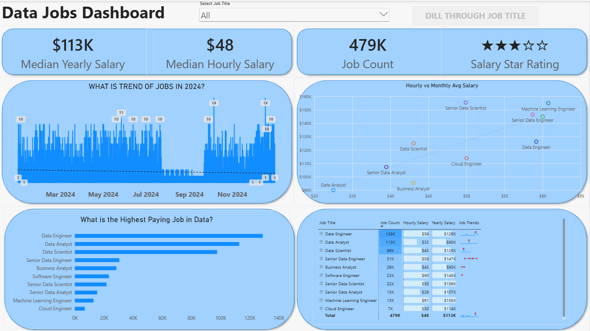
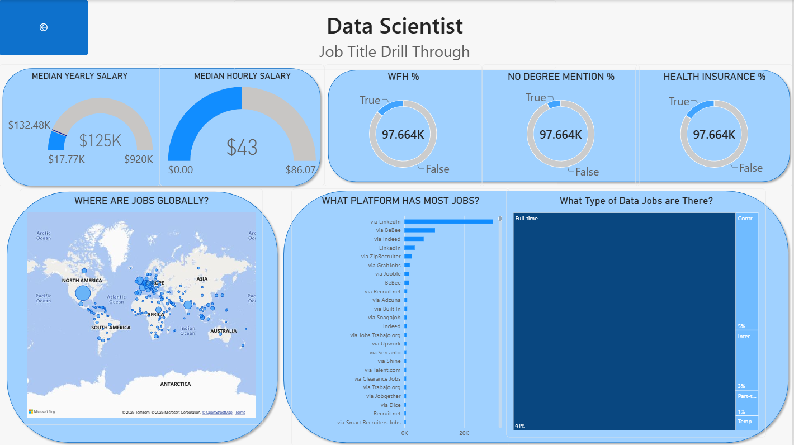

# Global Data Job Market Intelligence Dashboard

An interactive Power BI dashboard analyzing 479K+ global data job postings across 50+ countries, covering salary trends, remote work availability, and hiring platforms.

## Project File
[Bhanu Power BI Project.pbix](Bhanu%20Power%20BI%20Project.pbix)

## Tools Used
- Power BI Desktop
- Power Query
- DAX

## Key Features
- Star schema data model with a dedicated date table
- Custom DAX measures including a month-over-month growth calculation using CALCULATE and DATEADD
- Metrics for remote work percentage, no-degree-required roles, and average salary
- Drill-through page to explore salary, remote work rate, and hiring platforms by job title

## Dashboard Preview

## Drill Through Page

